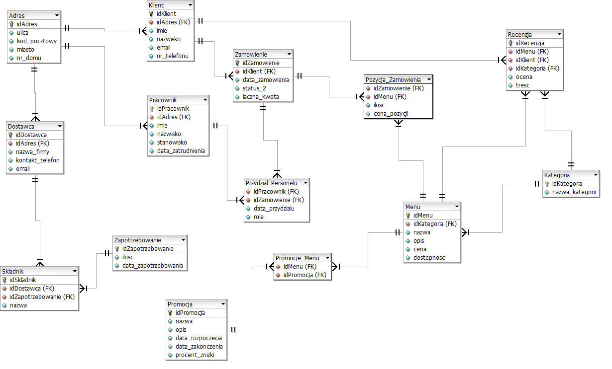

# Restaurant Database Project

## Introduction
This repository contains the SQL script for setting up a comprehensive database for a restaurant management system. The database includes tables for customers, menu items, orders, reviews, suppliers, staff, and more. It also features views, functions, procedures, and triggers to manage and analyze the data effectively.

## Database Schema
The database schema is designed to handle various aspects of restaurant operations:

- **Customers**: Store customer information and their addresses.
- **Menu**: Manage menu items categorized into different types like main courses, appetizers, etc.
- **Orders**: Track customer orders, including order details and statuses.
- **Reviews**: Capture customer reviews for menu items.
- **Suppliers**: Manage suppliers and their products.
- **Staff**: Handle staff information and their assignments to orders.
- **Promotions**: Manage promotional offers on menu items.

An Entity-Relationship Diagram (ERD) is provided to visualize the relationships between different tables.

## Sample Data
The SQL script includes sample data for all tables to demonstrate the database's functionality.

## Views, Functions, Procedures, and Triggers
The database includes:

- **Views**: To provide summarized or filtered data.
- **Functions**: For performing specific calculations or data retrievals.
- **Procedures**: For automating complex operations like adding new orders.
- **Triggers**: To enforce data integrity and perform automatic actions based on database events.

## Entity-Relationship Diagram (ERD)
An ERD is available in the repository to understand the database structure.

